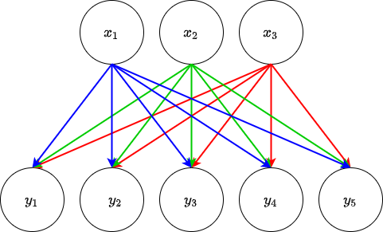

.. DO NOT EDIT.
.. THIS FILE WAS AUTOMATICALLY GENERATED BY SPHINX-GALLERY.
.. TO MAKE CHANGES, EDIT THE SOURCE PYTHON FILE:
.. "auto_examples/exa_fclayers.py"
.. LINE NUMBERS ARE GIVEN BELOW.

.. only:: html

    .. note::
        :class: sphx-glr-download-link-note

        Click :ref:`here <sphx_glr_download_auto_examples_exa_fclayers.py>`
        to download the full example code

.. rst-class:: sphx-glr-example-title

.. _sphx_glr_auto_examples_exa_fclayers.py:


.. _fclayer_exa:

Using the Fully-connected Layer
===============================

.. GENERATED FROM PYTHON SOURCE LINES 9-13

The following will demonstrate how to use the ``FCLayer`` object from the
``neural_network_layers`` script. This is a highly customisable
fully-connected layer for use in construction of bespoke neural networks. We
will start by importing the object.

.. GENERATED FROM PYTHON SOURCE LINES 13-20

.. code-block:: default


    import torch

    torch.manual_seed(12)
    import torch.nn as nn
    from cmacpy.nn.neural_network_layers import FCLayer


.. GENERATED FROM PYTHON SOURCE LINES 21-50

An ``FCLayer`` object can take a variety of arguments during construction (for
more detail see :ref:`layers`). Neural network layers in general are
constructed using two or three objects: a linear function, a normalisation
(optional) and a non-linear function. In a fully-connected layer, the linear
function takes the form a `PyTorch <https://pytorch.org/>`_ ``nn.Linear``
module which maps the input :math:`x` to the output :math:`y` via the
following equation

.. math::
   y = \Theta x + b

where :math:`\Theta` is known as the learnable parameters or weights of the
layer -- it is a matrix of numbers which multiplies the vector of inputs
:math:`x`. These are the parameters that are optimised to give the best
transformation of the data. :math:`b` is an optional, learnable bias of the
linear transformation. The two main arguments for the linear transformation
(and thus of the ``FCLayer`` object) are ``in_nodes`` and ``out_nodes``: this
is the dimensionality of the input :math:`x` and the dimensionality of the
output :math:`y`. This is used to construct the learnable parameters
:math:`\Theta`. ``in_nodes`` and ``out_nodes`` are integers.

The non-linear function (often referred to as the activation) that is part of
a neural network layer can be set through the ``activation`` keyword argument.
Its default value ``"relu"`` uses the rectified linear unit non-linearity but
other options exist [#f1]_.

Setting up an ``FCLayer``
-------------------------
To construct the layer we do the following:

.. GENERATED FROM PYTHON SOURCE LINES 50-55

.. code-block:: default


    fclayer = FCLayer(3, 5)

    print(fclayer)


.. rst-class:: sphx-glr-script-out

 Out:

 .. code-block:: none

    FCLayer(
      (lin): Linear(in_features=3, out_features=5, bias=False)
      (act): ReLU(inplace=True)
    )


.. GENERATED FROM PYTHON SOURCE LINES 56-96

This create a fully-connected layer with input dimension 3, output dimension
5, no bias and the ReLU non-linearity. This is shown in the figure below.



The input :math:`x` consists of three numbers: :math:`x_{1}, x_{2}, x_{3}`.
The output :math:`y` consists of five numbers: :math:`y_{1}, y_{2}, y_{3},
y_{4}, y_{5}`. The arrows indicate that each of the three inputs has a part to
play in forming each of the five outputs &mdash; this is where the name
"fully-connected" comes from, every input is connected to every output. Each
of these arrows also represent an element of the learnable parameters
:math:`\Theta` e.g. the value of :math:`y_{1}` is obtained via a linear
combination of the input values multiplied by the associated weight for that
connection. In more mathematical terms, :math:`\Theta` is a matrix consisting
of each weight ordered by the connections between the inputs and outputs.
Following our example, if we label the weight from :math:`x_{1}` to
:math:`y_{1}` as :math:`\theta_{11}`, the weight from :math:`x_{2}` to
:math:`y_{1}` as :math:`\theta_{12}` and so on and so forth then the matrix of
weights can be written as

.. math::
    \Theta = \begin{bmatrix}
                     \theta_{11} & \theta_{12} & \theta_{13} \\
                     \theta_{21} & \theta_{22} & \theta_{23} \\
                     \theta_{31} & \theta_{32} & \theta_{33} \\
                     \theta_{41} & \theta_{42} & \theta_{43} \\
                     \theta_{51} & \theta_{52} & \theta_{53}
              \end{bmatrix}

The output :math:`y` can then be calculated via matrix multiplication of
:math:`\Theta` and :math:`x` (plus the potential addition of the bias).

The outputs are then operated on by the activation to produce the final output
of the ``FCLayer``. In this example we use the ReLU activation which will
return the value passed to the function if the value is positive and will
return zero otherwise.

This is equivalent to defining a ``nn.Sequential`` object as follows

.. GENERATED FROM PYTHON SOURCE LINES 96-99

.. code-block:: default


    fcseq = nn.Sequential(nn.Linear(3, 5, bias=False), nn.ReLU(inplace=True))


.. GENERATED FROM PYTHON SOURCE LINES 100-104

The main idea is to have a nicer looking way of representing these layers
(especially when the networks get really deep). Each element of the
``FCLayer`` object can be accessed via class attributes ``.lin``` for the
linear function and ``.act`` for the non-linearity e.g.

.. GENERATED FROM PYTHON SOURCE LINES 104-107

.. code-block:: default


    print(fclayer.lin, fclayer.act)


.. rst-class:: sphx-glr-script-out

 Out:

 .. code-block:: none

    Linear(in_features=3, out_features=5, bias=False) ReLU(inplace=True)


.. GENERATED FROM PYTHON SOURCE LINES 108-110

A dummy input can be created to show that the objects ``fclayer`` and
``fcseq`` are equivalent.

.. GENERATED FROM PYTHON SOURCE LINES 110-115

.. code-block:: default


    dummy_input = torch.randint(
        10, (3,)
    ).float()  # randomly sample 3 integers from the range [0,10)


.. GENERATED FROM PYTHON SOURCE LINES 116-122

.. note::
    The default random initialisation for ``nn.Linear`` objects samples a
    uniform distribution bounded by :math:`\pm 1/\sqrt{dim(x)}` for *reasons*
    (I really don't know this answer to why). Due to the nature of the random
    sampling, the easiest way to compare these two examples is to initialise
    them with the same numbers. Below we initialise them with 0.5

.. GENERATED FROM PYTHON SOURCE LINES 122-126

.. code-block:: default


    nn.init.constant_(fclayer.weight, 0.5)
    nn.init.constant_(fcseq[0].weight, 0.5)


.. rst-class:: sphx-glr-script-out

 Out:

 .. code-block:: none


    Parameter containing:
    tensor([[0.5000, 0.5000, 0.5000],
            [0.5000, 0.5000, 0.5000],
            [0.5000, 0.5000, 0.5000],
            [0.5000, 0.5000, 0.5000],
            [0.5000, 0.5000, 0.5000]], requires_grad=True)


.. GENERATED FROM PYTHON SOURCE LINES 127-132

Then the output is calculated for passing the dummy inputs to the different
formulations of the layer.

.. note::
    The layers can be applied to inputs in the same manner as functions.

.. GENERATED FROM PYTHON SOURCE LINES 132-135

.. code-block:: default


    print(fclayer(dummy_input), fcseq(dummy_input))


.. rst-class:: sphx-glr-script-out

 Out:

 .. code-block:: none

    tensor([6., 6., 6., 6., 6.], grad_fn=<ReluBackward0>) tensor([6., 6., 6., 6., 6.], grad_fn=<ReluBackward0>)


.. GENERATED FROM PYTHON SOURCE LINES 136-139

Further, we can check how the layer we have defined interacts with gradient
backpropagation by creating a dummy desired output and a loss function that we
want to use to optmise our layer.

.. GENERATED FROM PYTHON SOURCE LINES 139-146

.. code-block:: default


    output = fclayer(dummy_input)
    output_seq = fcseq(dummy_input)
    dummy_output = torch.ones(5)
    loss = torch.nn.functional.mse_loss(output, dummy_output)
    loss_seq = torch.nn.functional.mse_loss(output_seq, dummy_output)


.. GENERATED FROM PYTHON SOURCE LINES 147-155

The above code assigns the output of the ``FCLayer`` applied to the dummy
input to the variable ``output`` alongside the output of the
``nn.Sequential``'s output being labelled ``output_seq``. Then a fake desired
output of ones in each dimension is created (``dummy_output``) and the mean
squared error is calculated for each to see how close the layer gets to this
desired output (``loss`` and ``loss_seq``, respectively following the naming
conventions for the outputs). The gradient of the loss with respect to each
weight is then calculated doing the following

.. GENERATED FROM PYTHON SOURCE LINES 155-159

.. code-block:: default


    loss.backward()
    loss_seq.backward()


.. GENERATED FROM PYTHON SOURCE LINES 160-161

These calculated gradients can then be accessed from the original objects.

.. GENERATED FROM PYTHON SOURCE LINES 161-164

.. code-block:: default


    print(fclayer.weight.grad, fcseq[0].weight.grad)


.. rst-class:: sphx-glr-script-out

 Out:

 .. code-block:: none

    tensor([[ 8., 10.,  6.],
            [ 8., 10.,  6.],
            [ 8., 10.,  6.],
            [ 8., 10.,  6.],
            [ 8., 10.,  6.]]) tensor([[ 8., 10.,  6.],
            [ 8., 10.,  6.],
            [ 8., 10.,  6.],
            [ 8., 10.,  6.],
            [ 8., 10.,  6.]])


.. GENERATED FROM PYTHON SOURCE LINES 165-172

As can be seen, both the outputs and the gradients calculated via
backpropagation are identical whether using this customisable block or using
raw PyTorch so hopefully having a tidier wrapper to keep everything in is
useful!

For more advanced use of the ``FCLayer`` object, the interested reader is
referred to :ref:`fclayer_adv_exa`.

.. GENERATED FROM PYTHON SOURCE LINES 175-179

.. [#f1] These are the most commonly-used non-linearities but implementations
         of other can be added when needed. Also, a custom non-linearity
         function being addable is being considered (I only thought of it when
         writing this document).


.. rst-class:: sphx-glr-timing

   **Total running time of the script:** ( 0 minutes  0.005 seconds)


.. _sphx_glr_download_auto_examples_exa_fclayers.py:


.. only :: html

 .. container:: sphx-glr-footer
    :class: sphx-glr-footer-example


  .. container:: sphx-glr-download sphx-glr-download-python

     :download:`Download Python source code: exa_fclayers.py <exa_fclayers.py>`


  .. container:: sphx-glr-download sphx-glr-download-jupyter

     :download:`Download Jupyter notebook: exa_fclayers.ipynb <exa_fclayers.ipynb>`


.. only:: html

 .. rst-class:: sphx-glr-signature

    `Gallery generated by Sphinx-Gallery <https://sphinx-gallery.github.io>`_
