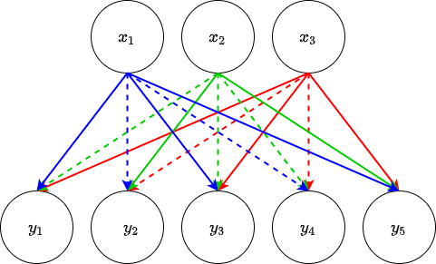

.. DO NOT EDIT.
.. THIS FILE WAS AUTOMATICALLY GENERATED BY SPHINX-GALLERY.
.. TO MAKE CHANGES, EDIT THE SOURCE PYTHON FILE:
.. "auto_examples/exa_fclayers_adv.py"
.. LINE NUMBERS ARE GIVEN BELOW.

.. only:: html

    .. note::
        :class: sphx-glr-download-link-note

        Click :ref:`here <sphx_glr_download_auto_examples_exa_fclayers_adv.py>`
        to download the full example code

.. rst-class:: sphx-glr-example-title

.. _sphx_glr_auto_examples_exa_fclayers_adv.py:

.. _fclayer_adv_exa:

Advanced Usage of the Fully-connected Layer
===========================================

.. GENERATED FROM PYTHON SOURCE LINES 9-13

The following makes the assumption that you are already comfortable with the
contents of :ref:`fclayer_exa`.

As always, the layer must be imported

.. GENERATED FROM PYTHON SOURCE LINES 13-16

.. code-block:: default

    from cmacpy.nn.neural_network_layers import FCLayer

.. GENERATED FROM PYTHON SOURCE LINES 17-29

Normalisation
-------------
A third, often vital, operation part of any neural network layer is the
normalisation layer. Normalisation across batches of data (known as "batch
normalisation") is useful in reducing the dynamic range of your batches at the
expense of having a learnable mean and standard deviation. In the grand scheme
of having millions of fitted parameters in your network, having a couple more
due to batch normalisation is preferable over the network taking some time to
learn the data distribution.

Normalisation can be added to an ``FCLayer`` object using the keyword argument
``normalisation``

.. GENERATED FROM PYTHON SOURCE LINES 29-32

.. code-block:: default

    fclayer = FCLayer(3, 5, normalisation="batch", initialisation=None)

.. GENERATED FROM PYTHON SOURCE LINES 33-36

Valid options here are ``"batch"`` and ``"instance"`` to add batch
normalisation and instance normalisation respectively but batch normalisation
is typically the most useful. The layout of the layer is then

.. GENERATED FROM PYTHON SOURCE LINES 36-39

.. code-block:: default

    print(fclayer)

.. rst-class:: sphx-glr-script-out

 Out:

 .. code-block:: none

    FCLayer(
      (lin): Linear(in_features=3, out_features=5, bias=False)
      (norm): BatchNorm1d(5, eps=1e-05, momentum=0.1, affine=True, track_running_stats=True)
      (act): ReLU(inplace=True)
    )

.. GENERATED FROM PYTHON SOURCE LINES 40-42

The normalisation operation itself can be accessed via the ``.norm`` attribute
of the class

.. GENERATED FROM PYTHON SOURCE LINES 42-45

.. code-block:: default

    print(fclayer.norm)

.. rst-class:: sphx-glr-script-out

 Out:

 .. code-block:: none

    BatchNorm1d(5, eps=1e-05, momentum=0.1, affine=True, track_running_stats=True)

.. GENERATED FROM PYTHON SOURCE LINES 46-76

Dropout
-------
Another technique that can be added to neural network layers is called
"dropout". Dropout will assign a probability to each of the connections in a
fully-connected layer and randomly not use those transformations during
learning iterations. This is employed in deeper networks to avoid overfitting
with the intuition that the model only being able to use some of its
parameters while training will result in a more general model. An example of
this is shown in the image below: using our same fully-connected layer defined
above, there is a probability that an input won't be used to calculate an
output. Instead the output will be estimated from a subset of the parameters.
This is indicated by the dashed lines e.g. without dropout the output
:math:`y_{1}` is calculated by combining the inputs :math:`x_{1}, x_{2},
x_{3}`, however in this example the connection from :math:`x_{2}` to
:math:`y_{1}`
is dropped meaning :math:`y_{1}` is now calculated from just :math:`x_{1},
x_{3}`

There are two keyword arguments associated with dropout here: ``use_dropout``
which can be set to ``True`` if the user wishes to include dropout in the
layer and ``dropout_prob`` which is the probability assigned to each
connection of whether or not it will be dropped (the default value for this is
0.5, 50% chance of the connection not being used).

For example if we wanted to make an ``FCLayer`` which uses dropout and each
connection has a 30% chance of being dropped this would be formulated like so

.. GENERATED FROM PYTHON SOURCE LINES 76-83

.. code-block:: default

    fclayer = FCLayer(
        3, 5, normalisation="batch", initialisation=None, use_dropout=True, dropout_prob=0.3
    )

    print(fclayer)

.. rst-class:: sphx-glr-script-out

 Out:

 .. code-block:: none

    FCLayer(
      (lin): Linear(in_features=3, out_features=5, bias=False)
      (norm): BatchNorm1d(5, eps=1e-05, momentum=0.1, affine=True, track_running_stats=True)
      (act): ReLU(inplace=True)
      (dropout): Dropout(p=0.3, inplace=False)
    )

.. GENERATED FROM PYTHON SOURCE LINES 84-86

The dropout operation can then be accessed via the ``.dropout`` attribute of
the class.

.. GENERATED FROM PYTHON SOURCE LINES 86-89

.. code-block:: default

    print(fclayer.dropout)

.. rst-class:: sphx-glr-script-out

 Out:

 .. code-block:: none

    Dropout(p=0.3, inplace=False)

.. GENERATED FROM PYTHON SOURCE LINES 90-113

Initialisation
--------------
The last thing that can be added to the ``FCLayer`` is a different
initialisation scheme for the weights. So far, we have been setting the
``initalisation`` keyword argument to ``None`` which causes the learnable
parameters to be initialised using the standard method discussed in
:ref:`fclayer_exa`. Other initialisation methods can be employed through this
kwarg, namely He initialisation and Xavier initialisation.

He initialisation (the default), was used for `the first deep learning
algorithm that surpassed human level classification percentage
<https://arxiv.org/abs/1502.01852>`_, bases the initialisation on drawing
random samples from a normal distribution with mean zero and standard
deviation inversely proportional to the number of connections in a layer and
proportional to a value describing the effect the non-linear function has on
the variance of the output distribution (for a mathematical derivation of this
see the paper above) and using these as the starting points for the weights.

Xavier initialisation is a special case of He initialisation where it is
assumed that the non-linearity does not contribute to the variance of the
output distribution of the layer.

Initialisation using both schemes is shown below

.. GENERATED FROM PYTHON SOURCE LINES 113-122

.. code-block:: default

    fclayer = FCLayer(3, 5, normalisation="batch", initialisation="he")

    print(fclayer.weight)

    fclayer = FCLayer(3, 5, normalisation="batch", initialisation="xavier")

    print(fclayer.weight)

.. rst-class:: sphx-glr-script-out

 Out:

 .. code-block:: none

    Parameter containing:
    tensor([[-0.6785,  1.3710, -0.0451],
            [-0.3150,  0.4278,  0.6482],
            [ 0.7957,  0.4606, -0.2382],
            [-0.2779,  0.0152,  0.5526],
            [ 1.1491, -1.1252,  0.2854]], requires_grad=True)
    Parameter containing:
    tensor([[-0.9872, -1.5179, -0.2189],
            [ 1.8689,  0.3534,  0.5369],
            [ 1.2403, -0.7652,  1.1136],
            [ 1.1661, -0.0976,  0.1866],
            [ 0.5322,  0.4943,  0.1102]], requires_grad=True)

.. rst-class:: sphx-glr-timing

   **Total running time of the script:** ( 0 minutes  0.004 seconds)

.. _sphx_glr_download_auto_examples_exa_fclayers_adv.py:

.. only :: html

 .. container:: sphx-glr-footer
    :class: sphx-glr-footer-example

  .. container:: sphx-glr-download sphx-glr-download-python

     :download:`Download Python source code: exa_fclayers_adv.py <exa_fclayers_adv.py>`

  .. container:: sphx-glr-download sphx-glr-download-jupyter

     :download:`Download Jupyter notebook: exa_fclayers_adv.ipynb <exa_fclayers_adv.ipynb>`

.. only:: html

 .. rst-class:: sphx-glr-signature

    `Gallery generated by Sphinx-Gallery <https://sphinx-gallery.github.io>`_
